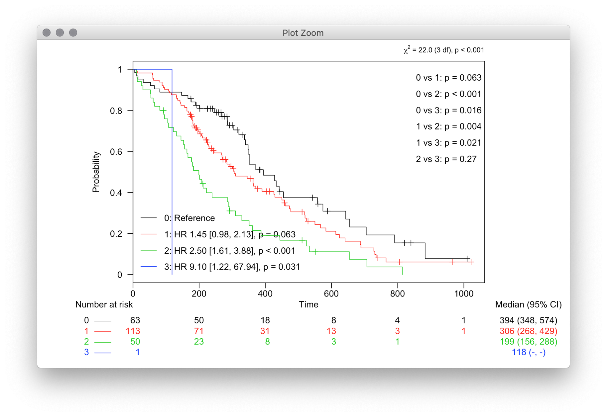
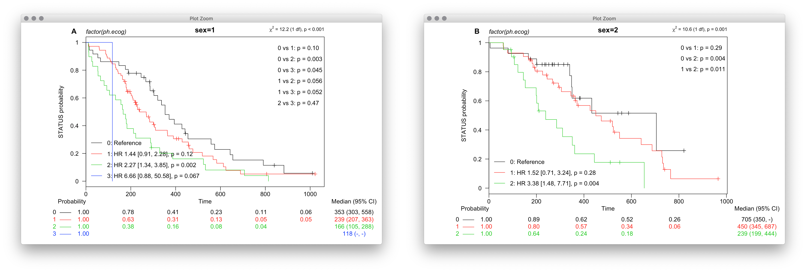
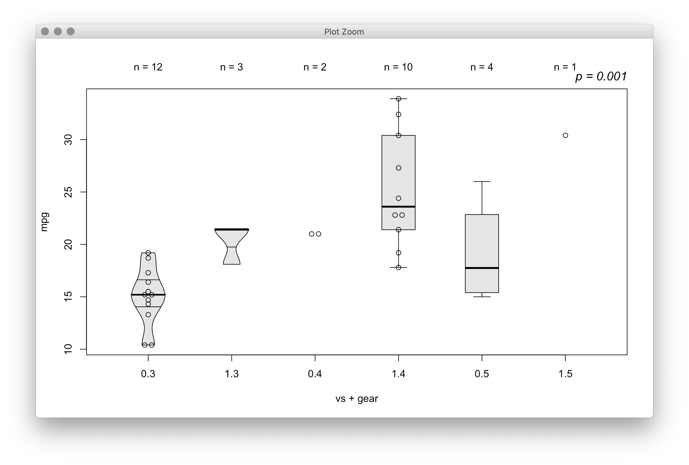
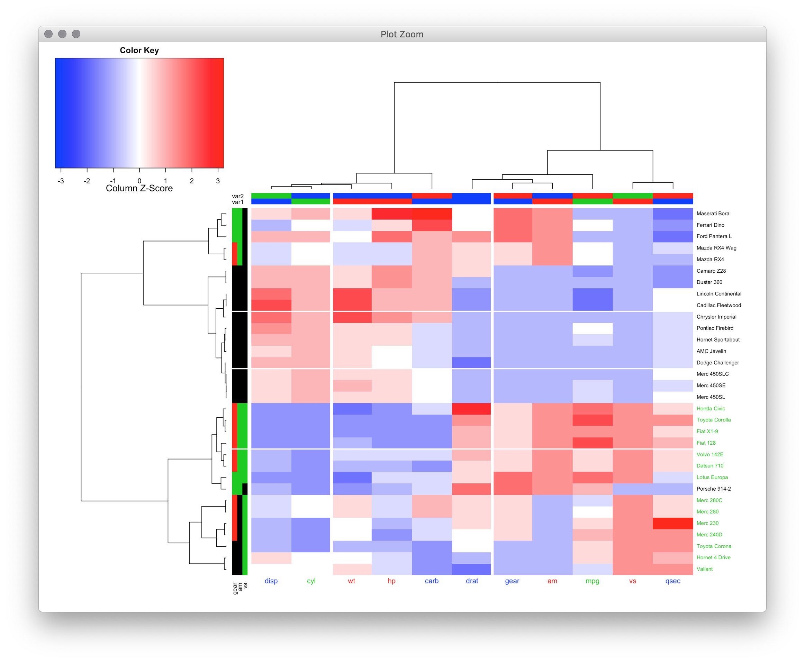

rawr
====

personal package with miscellaneous functions, stuff in progress, and tools I use regularly

to install:

```r
# install.packages('devtools')
devtools::install_github('raredd/rawr')
```

---

**some useful things for ...**


### survival analysis


**kaplan-meier with a whole bunch of extra junk**

```r
library('survival')
s <- survfit(Surv(time, status) ~ factor(ph.ecog), cancer)

kmplot(
  s,
  atrisk.col = TRUE, strata.lab = TRUE,
  median = TRUE, hr_text = TRUE, pw_test = TRUE
)
```



**convenience function for survival analysis**

```r
kmplot_by(
  'factor(ph.ecog)', time = 'time', event = 'status', cancer,
  tt_test = TRUE, by = 'sex', strata_lab = FALSE, atrisk.type = 'survival',
  atrisk.col = TRUE, median = TRUE, hr_text = TRUE, pw_test = TRUE
)
```



**get the pairwise differences easily**

```r
survdiff_pairs(s)
```

```
## $n
##     0   1  2  3
## 0  63  NA NA NA
## 1 176 113 NA NA
## 2 113 163 50 NA
## 3  64 114 51  1
##
## $chi.sq
##           0        1       2  3
## 0        NA       NA      NA NA
## 1  3.456831       NA      NA NA
## 2 16.682328 8.433446      NA NA
## 3  5.779873 5.333335 1.24231 NA
##
## $p.value
##           0         1         2         3
## 0        NA 0.1259819 0.0002651 0.0648429
## 1 0.0629909        NA 0.0184191 0.0648429
## 2 0.0000442 0.0036838        NA 0.2650263
## 3 0.0162107 0.0209213 0.2650263        NA
##
## attr(,"class")
## [1] "survdiff_pairs"
```

### misc plots

**box plot + violin plot + dot plot + testing + ...**


```r
tplot(
  mpg ~ vs + gear, mtcars, test = TRUE,
  type = c('dv', 'v', 'd', 'db', 'b', 'd'),
  quantiles = c(0.25, 0.5, 0.75), lwd = c(1, 2.5, 1)
)
```



**heatmap + row/column matrices + formatting**


```r
x <- scale(as.matrix(mtcars))

rc <- cbind(gear = x[, 'gear'], am = x[, 'am'], vs = x[, 'vs'])
rc[] <- palette()[rc + 2L]

cc <- rbind(var1 = nchar(colnames(x)), var2 = nchar(sort(colnames(x))))
cc[] <- palette()[cc]

heatmap.3(
  x, scale = 'column', distfun = 'spearman', hclustfun = 'ward.D2',
  RowSideColors = rc, ColSideColors = cc,
  labRowCol = rc[, 3], labColCol = cc[1, ],
  margins = c(5, 10),
  colsep = c(2, 6), rowsep = c(9, 14, 21), sepwidth = c(5, 2)
)
```



### stat things

**tests for doubly- (jonckheere-terpstra) or singly-ordered (kruskal-wallis) tables**

```r
tbl <- table(mtcars$gear, mtcars$cyl)
# fisher.test(tbl)
jt.test(tbl)
```

```
##
## 	Jonckheere-Terpstra Test
##
## data:  tbl
## z = -3.1551, p-value = 0.001604
```

```r
kw.test(tbl, simulate.p.value = TRUE)
```

```
##
## 	Kruskal-Wallis test for count data with simulated p-value (based on 2000 replicates)
##
## data:  tbl
## Kruskal-Wallis chi-squared = 16.722, df = 2, p-value < 2.2e-16
## 99 percent confidence interval:
##  0.000000000 0.002299936
```

**test for _ordered_ kruskal-wallis rank-sum**

```r
# kruskal.test(mpg ~ cyl, mtcars)
cuzick.test(mpg ~ cyl, mtcars)
```

```
##
## 	Wilcoxon rank-sum test for trend in 3 ordered groups (corrected for ties)
##
## data:  mpg by cyl
## z = -5.0741, p-value = 3.894e-07
## sample estimates:
## median of 4 median of 6 median of 8
##        26.0        19.7        15.2
```

### knitr/convenience things

**basically a table**

```r
tabler_by2(
  mtcars, c('gear', 'vs'), 'cyl',
  stratvar = 'am', n = table(mtcars$am),
  zeros = '-', pct = TRUE, pct.total = TRUE
)
```

```
##   vs  Total      Total      4         6         8          Total     4         6         8
## 3 "0" "12 (38%)" "12 (63%)" "-"       "-"       "12 (63%)" "-"       "-"       "-"       "-"
##   "1" "3 (9%)"   "3 (16%)"  "1 (5%)"  "2 (11%)" "-"        "-"       "-"       "-"       "-"
## 4 "0" "2 (6%)"   "-"        "-"       "-"       "-"        "2 (15%)" "-"       "2 (15%)" "-"
##   "1" "10 (31%)" "4 (21%)"  "2 (11%)" "2 (11%)" "-"        "6 (46%)" "6 (46%)" "-"       "-"
## 5 "0" "4 (13%)"  "-"        "-"       "-"       "-"        "4 (31%)" "1 (8%)"  "1 (8%)"  "2 (15%)"
##   "1" "1 (3%)"   "-"        "-"       "-"       "-"        "1 (8%)"  "1 (8%)"  "-"       "-"
```

**basically a table**

```r
tabler_stat2(
  within(mtcars, cyl <- factor(cyl, ordered = TRUE)),
  c('Miles/gal' = 'mpg', 'Engine (V/S)' = 'vs', Cylinders = 'cyl'),
  c('# of gears' = 'gear'), correct = 'BH',
  htmlArgs = list(caption = 'Table 1.')
)
```

<table class='gmisc_table' style='border-collapse: collapse; margin-top: 1em; margin-bottom: 1em;' >
<thead>
<tr><td colspan='9' style='text-align: left;'>
Table 1.</td></tr>
<tr>
<th style='border-top: 2px solid grey;'></th>
<th colspan='1' style='font-weight: 900; border-top: 2px solid grey; text-align: center;'></th><th style='border-top: 2px solid grey;; border-bottom: hidden;'>&nbsp;</th>
<th colspan='3' style='font-weight: 900; border-bottom: 1px solid grey; border-top: 2px solid grey; text-align: center;'># of gears</th><th style='border-top: 2px solid grey;; border-bottom: hidden;'>&nbsp;</th>
<th colspan='2' style='font-weight: 900; border-top: 2px solid grey; text-align: center;'></th>
</tr>
<tr>
<th style='border-bottom: 1px solid grey;'> </th>
<th style='border-bottom: 1px solid grey; text-align: center;'>Total<br /><font weight=normal; size=1>n = 32 (%)</font></th>
<th style='border-bottom: 1px solid grey;' colspan='1'>&nbsp;</th>
<th style='border-bottom: 1px solid grey; text-align: center;'>3<br /><font weight=normal; size=1>n = 15 (47)</font></th>
<th style='border-bottom: 1px solid grey; text-align: center;'>4<br /><font weight=normal; size=1>n = 12 (38)</font></th>
<th style='border-bottom: 1px solid grey; text-align: center;'>5<br /><font weight=normal; size=1>n = 5 (16)</font></th>
<th style='border-bottom: 1px solid grey;' colspan='1'>&nbsp;</th>
<th style='border-bottom: 1px solid grey; text-align: center;'><i>p-value</i></th>
<th style='border-bottom: 1px solid grey; text-align: center;'><i>BH p-value</i></th>
</tr>
</thead>
<tbody>
<tr><td colspan='9' style='font-weight: 900;'>Miles/gal</td></tr>
<tr>
<td style='text-align: left;'>&nbsp;&nbsp;Median (range)</td>
<td style='padding: 0px 5px 0px; white-space: nowrap; text-align: center;'>19.2 (10.4 - 33.9)</td>
<td style='' colspan='1'>&nbsp;</td>
<td style='padding: 0px 5px 0px; white-space: nowrap; text-align: center;'>15.5 (10.4 - 21.5)</td>
<td style='padding: 0px 5px 0px; white-space: nowrap; text-align: center;'>22.8 (17.8 - 33.9)</td>
<td style='padding: 0px 5px 0px; white-space: nowrap; text-align: center;'>19.7 (15.0 - 30.4)</td>
<td style='' colspan='1'>&nbsp;</td>
<td style='padding: 0px 5px 0px; white-space: nowrap; text-align: center;'><i><font color="#FF0000">&lt; 0.001</font></i><sup>&dagger;</sup></td>
<td style='padding: 0px 5px 0px; white-space: nowrap; text-align: center;'><font color="#FF0000">0.001</font></td>
</tr>
<tr><td colspan='9' style='font-weight: 900;'>Engine (V/S)</td></tr>
<tr>
<td style='text-align: left;'>&nbsp;&nbsp;Median (range)</td>
<td style='padding: 0px 5px 0px; white-space: nowrap; text-align: center;'>0 (0 - 1)</td>
<td style='' colspan='1'>&nbsp;</td>
<td style='padding: 0px 5px 0px; white-space: nowrap; text-align: center;'>0 (0 - 1)</td>
<td style='padding: 0px 5px 0px; white-space: nowrap; text-align: center;'>1 (0 - 1)</td>
<td style='padding: 0px 5px 0px; white-space: nowrap; text-align: center;'>0 (0 - 1)</td>
<td style='' colspan='1'>&nbsp;</td>
<td style='padding: 0px 5px 0px; white-space: nowrap; text-align: center;'><i><font color="#FF0000">0.001</font></i><sup>&Dagger;</sup></td>
<td style='padding: 0px 5px 0px; white-space: nowrap; text-align: center;'><font color="#FF0000">0.001</font></td>
</tr>
<tr><td colspan='9' style='font-weight: 900;'>Cylinders</td></tr>
<tr>
<td style='text-align: left;'>&nbsp;&nbsp;4</td>
<td style='padding: 0px 5px 0px; white-space: nowrap; text-align: center;'>11 (34)</td>
<td style='' colspan='1'>&nbsp;</td>
<td style='padding: 0px 5px 0px; white-space: nowrap; text-align: center;'>1 (7)</td>
<td style='padding: 0px 5px 0px; white-space: nowrap; text-align: center;'>8 (67)</td>
<td style='padding: 0px 5px 0px; white-space: nowrap; text-align: center;'>2 (40)</td>
<td style='' colspan='1'>&nbsp;</td>
<td style='padding: 0px 5px 0px; white-space: nowrap; text-align: center;'><i><font color="#FF0000">&lt; 0.001</font></i><sup>&dagger;</sup></td>
<td style='padding: 0px 5px 0px; white-space: nowrap; text-align: center;'><font color="#FF0000">&lt; 0.001</font></td>
</tr>
<tr>
<td style='text-align: left;'>&nbsp;&nbsp;6</td>
<td style='padding: 0px 5px 0px; white-space: nowrap; text-align: center;'>7 (22)</td>
<td style='' colspan='1'>&nbsp;</td>
<td style='padding: 0px 5px 0px; white-space: nowrap; text-align: center;'>2 (13)</td>
<td style='padding: 0px 5px 0px; white-space: nowrap; text-align: center;'>4 (33)</td>
<td style='padding: 0px 5px 0px; white-space: nowrap; text-align: center;'>1 (20)</td>
<td style='' colspan='1'>&nbsp;</td>
<td style='padding: 0px 5px 0px; white-space: nowrap; text-align: center;'></td>
<td style='padding: 0px 5px 0px; white-space: nowrap; text-align: center;'></td>
</tr>
<tr>
<td style='border-bottom: 2px solid grey; text-align: left;'>&nbsp;&nbsp;8</td>
<td style='padding: 0px 5px 0px; white-space: nowrap; border-bottom: 2px solid grey; text-align: center;'>14 (44)</td>
<td style='border-bottom: 2px solid grey;' colspan='1'>&nbsp;</td>
<td style='padding: 0px 5px 0px; white-space: nowrap; border-bottom: 2px solid grey; text-align: center;'>12 (80)</td>
<td style='padding: 0px 5px 0px; white-space: nowrap; border-bottom: 2px solid grey; text-align: center;'>-</td>
<td style='padding: 0px 5px 0px; white-space: nowrap; border-bottom: 2px solid grey; text-align: center;'>2 (40)</td>
<td style='border-bottom: 2px solid grey;' colspan='1'>&nbsp;</td>
<td style='padding: 0px 5px 0px; white-space: nowrap; border-bottom: 2px solid grey; text-align: center;'></td>
<td style='padding: 0px 5px 0px; white-space: nowrap; border-bottom: 2px solid grey; text-align: center;'></td>
</tr>
</tbody>
<tfoot><tr><td colspan='9'>
<font size=1><sup>&dagger;</sup>Kruskal-Wallis rank-sum test, <sup>&Dagger;</sup>Fisher's exact test, <sup>&dagger;</sup>Kruskal-Wallis trend test</font></td></tr></tfoot>
</table>

**a table, basically**

```r
set.seed(1)
r <- c('CR', 'PR', 'SD', 'PD', 'NE')
x <- factor(sample(r, 30, replace = TRUE), r)

table(x)
```

```
## x
## CR PR SD PD NE
##  4 11  2  7  6
```

```r
t(t(tabler_resp(x, 3:1)))
```

```
##              [,1]
## CR           "4/30, 13% (95% CI: 4 - 31%)"
## PR           "11/30, 37% (95% CI: 20 - 56%)"
## SD           "2/30, 7% (95% CI: 1 - 22%)"
## PD           "7/30, 23% (95% CI: 10 - 42%)"
## NE           "6/30, 20% (95% CI: 8 - 39%)"
## SD or better "17/30, 57% (95% CI: 37 - 75%)"
## PR or better "15/30, 50% (95% CI: 31 - 69%)"
## CR or better "4/30, 13% (95% CI: 4 - 31%)"
```

**in-line convenience functions**

```r
intr(mtcars$mpg)
```

```
## [1] "19 (range: 10 - 34)"
```

```r
intr(mtcars$mpg, conf = 0.95)
```

```
## [1] "19 (95% CI: 10 - 33)"
```

```r
countr(mtcars$cyl)
```

```
## [1] "4 (n = 11, 34%), 6 (n = 7, 22%), and 8 (n = 14, 44%)"
```

```r
countr(table(mtcars$vs))
```

```
## [1] "0 (n = 18, 56%) and 1 (n = 14, 44%)"
```
