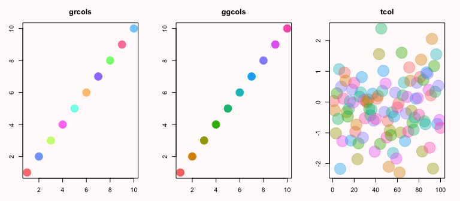

rawr
====

personal package with miscellaneous functions, stuff in progress, and tools I use regularly

to install:
```
# install.packages('devtools')
devtools::install_github('raredd/rawr')
```

about
====

<font align = center>

### [graphics](#some-rawr-graphics)

**[joint marginal, box, discrete scatter plots](#special-plots)** <br> **[plotting utilities](#plotting-utils)** <br> **[other gg plots](#other-gg-plots)** | **[survival plots in base and gg](#survival-in-base-and-gg)**

#### more stuff <a href = 'https://github.com/raredd/rgraphics'>here</a>

### [utils](#rawr-utils)

**[utils](#rawr-utils)** | **[stat things](#stat-things)** | **[SAS things](#sas-things)**

</font>

---


## some rawr graphics

### plots / plot utils

 name           | function
----------------|---------------
`bpCI`          | add error bars/sig stars to barplots
`click.shape`   | add shapes interactively
`click.text`    | add text interactively
`dodge`         | dodge points (alternative to jitter)
`dsplot`        | discrete scatter plot
`facet_adjust`  | ggplot facet adjust
`ggcaterpillar` | caterpillar using ggplot
`ggcols`        | replicate ggplot colors
`ggheat`        | heatmap using ggplot
`ggmultiplot`   | align multiple ggplots on single layout
`ggsurv`        | survival curve using ggplot
`grcols`        | golden ratio colors
`inset`         | inset plots inside plots
`jmplot`        | joint marginal plot
`kmplot`        | survival curve using base
`multiplot`     | plot multiple base plots on single layout
`show.colors`   | show all base colors
`show.pch`      | show all base plotting characters
`tcol`          | add transparency to colors
`tplot`         | improved boxplots


```r
library(rawr)
library(ggplot2)
library(grid)
library(gridExtra)

op <- par(no.readonly = TRUE)
```


## special plots

### joint marginal, box, and discrete scatter plots


```r
## jmplot
set.seed(1618)
dat <- data.frame(x = rnorm(100, 20, 5),
                  y = rexp(100),
                  z = c('M','F'),
                  zz = c(LETTERS[1:4]))
dat[1:5, 1:2] <- NA
with(dat, jmplot(x, y, z, type = 'db', jit = .02, col = 1:2, las = 1,
     group.col = TRUE, pch = 1:2, group.pch = TRUE, boxcol = grey(.9),
     cex.n = .8))
```

<figure><figcaption>Figure 1: special plots</figcaption></figure>

```r
## tplot
par(op)
set.seed(1618)
dat <- data.frame(age = rnorm(80, rep(c(26, 36), c(70, 10)), 4),
                  sex = sample(c('Female', 'Male'), 80, replace = TRUE),
                  group = paste0('Group ',
                                 sample(1:4, 40, prob = c(2, 5, 4, 1),
                                        replace = TRUE)))
dat[1:5, 'age'] <- NA
tplot(age ~ group, data = dat, las = 1, cex.n = .8, cex.axis = 1, bty = 'L',
      type = c('db', 'db', 'db', 'd'), names = LETTERS[1:4],
      group.pch = TRUE, pch = c(15, 17, 19, 8),
      group.col = FALSE, col = c('darkred', 'darkblue')[c(sex)],
      boxcol = c('lightsteelblue1', 'lightyellow1', grey(.9)),
      boxplot.pars = list(notch = TRUE, boxwex = .5))
```

<figure><figcaption>Figure 2: special plots</figcaption></figure>

```r
## dsplot
par(op)
set.seed(1618)
x <- round(rnorm(400, 100, 4))
y <- round(rnorm(400, 200, 4))
sex <- sample(c('Female', 'Male'), 400, replace = TRUE)
dsplot(y ~ x, pch = 19, col = 1 + (sex %in% 'Female'), cex = .6,
       xlab = 'measurement 1', ylab = 'measurement 2', bty = 'L')
legend('bottomright', pch = 19, col = 1:2, bty = 'n',
       legend = c('Male', 'Female'), cex = .8)
```

<figure><figcaption>Figure 3: special plots</figcaption></figure>


```r
## a pretty legend
par(mfrow = c(2,1))
with(mtcars,
     plot(mpg, pch = 19, cex = 2, main = 'color by weight (red = heavier)',
     col = colorRampPalette(c('yellow','red'))(1000)[rescaler(wt, c(1, 1000))]))
with(mtcars,
     plot(mpg, pch = 19, cex = 2, bty = 'l', main = 'color by weight (red = heavier)',
     col = color.bar(c('yellow','red'), x = wt, y = mpg, labels = wt)))
```

<figure><figcaption>Figure 6: Legend</figcaption></figure>


### plotting utils

```r
## show colors
colors()[70]
```

```
## [1] "cyan2"
```

```r
show.colors()
```

<figure><figcaption>Figure 7: Utilities</figcaption></figure>

```r
## show plotting characters
show.pch()
```

<figure><figcaption>Figure 8: Utilities</figcaption></figure>

```r
## transparent colors
cols <- c('orange', 'magenta1', 'lightblue')
plot(rnorm(100), col = tcol(cols, 100), pch = 16, cex = 4, 
     axes = FALSE, xpd = NA, xlab = '', ylab = '')
```

<figure><figcaption>Figure 9: Utilities</figcaption></figure>

```r
## add missing facets for some ggplots

## ?facet_adjust
library(ggplot2)
library(grid)
# missing some labels
(tmp <- ggplot(diamonds[1:100, ], aes(carat, price, colour = clarity)) +
  geom_point() + facet_wrap( ~ cut))
```

<figure><figcaption>Figure 10: Utilities</figcaption></figure>

```r
facet_adjust(tmp)
```

<figure><figcaption>Figure 11: Utilities</figcaption></figure>

```r
## ?dodge
par(op)
set.seed(1618)
dat <- data.frame(x = rpois(50, 1), grp = 1:5)
par(list(mfrow = c(2, 2),
         mar = c(3,1,2,2)))
with(dat, plot(grp, x, main = 'overlapping points'))
with(dat, plot(grp, x, cex = runif(100), main = 'still overlapping points'))
with(dat, plot(jitter(grp), x, main = 'adding random noise'))
with(dat, plot(grp + dodge(x ~ grp, dat), x, main = 'dodge points'))
```

<figure><figcaption>Figure 12: Utilities</figcaption></figure>

```r
## color functions
par(mfrow = c(1, 3), pch = 20, bg = "snow", mar = c(3, 3, 3, 2))
plot(1:10, col = grcols(10), main = "grcols", cex = 4)
plot(1:10, col = ggcols(10), main = "ggcols", cex = 4)
plot(rnorm(100), col = tcol(ggcols(10), 100), main = "tcol", cex = 6)
```

<figure><figcaption>Figure 1: Color functions</figcaption></figure>


### interactive base plots


```r
## add shapes or text (and expressions) interactively

?click.shape

?click.text
```


### other gg plots


```r
## heat map

## ?ggheat
tmp <- rescaler(matrix(1:25, 5))
diag(tmp) <- 1
colnames(tmp) <- rownames(tmp) <- LETTERS[1:5]
grobs <- list(ggheat(cors = tmp, limits = c(0, 1)),
              ggheat(cors = tmp, gradn = NULL, gradc = c('white','red')))
(do.call(arrangeGrob, c(grobs, nrow = 1, ncol = 2)))
```

<figure><figcaption>Figure 13: Other ggplots</figcaption></figure>

```r
## caterpillar plot

## ?ggcaterpillar
library(lme4)
fit <- lmer(Reaction ~ Days + (Days | Subject), data = sleepstudy)
ggcaterpillar(ranef(fit, condVar = TRUE))
```

```
## $Subject
```

<figure><figcaption>Figure 14: Other ggplots</figcaption></figure>


## survival in base and gg


```r
## create kaplan-meier or cox ph plots with base or gg
try_require(survival)
cancer <- within(cancer, {
  age.cat <- factor(as.numeric(cut(age, c(-Inf, 50, 60, 70, Inf))))
})
kmfit <- survfit(Surv(time = time, event = status) ~ sex, data = cancer,
  conf.type = 'log-log')
coxfit <- survfit(coxph(Surv(time = time, event = status) ~ strata(I(age > 45)),
  data = cancer))
## base plots
## ?kmplot
kmplot(kmfit, dev = FALSE, col.band = 1:2, strata.lab = c('Male','Female'))
```

<figure><figcaption>Figure 15: Survival curves</figcaption></figure>

```r
## ggplot plots
## ?ggsurv
ggsurv(coxfit, legend.labels = c('< 45','> 45'), legend = FALSE, median = TRUE)
```

```
## ticks not specified: 
## tick marks defaulting to seq(0, max(time), length.out = 10)
```

```
## 
## strata labels recoded as follows:
## 
##            original replaced
## 1 I(age > 45)=FALSE     < 45
## 2  I(age > 45)=TRUE     > 45
## level(s) < 45 > 45 added to factor variable survdat$strata 
## median survival times:
## I(age > 45)=FALSE  I(age > 45)=TRUE 
##                NA               310
```

<figure><figcaption>Figure 16: Survival curves</figcaption></figure>

---

### SAS utils

 name        | function
-------------|---------------
`r2sas`      | write/run sas code in r
`get_margs`  | extract macro name(s) and arguments from a text file
`rmacro`     | runs sas macros from .sas files
`sas.mget`   | converts one or more sas data sets to r data frames and returns list
`source_sas` | source-esque function for .sas files

### rawr utils

 name         | function
--------------|---------------
`%||%`        | `||` ruby analogue
`%inside%`    | inside interval
`%ni%`        | negation of `%in%`
`bind_all`    | `rbind` or `cbind` objects with unequal rows/columns
`clc`         | remove all objects from workspace
`clear`       | clear console window
`clist`       | concatenate named list
`fapply`      | apply list of functions
`ht`          | head/tail
`ident`       | generalized `identical` function for two or more objects
`interleave`  | interleave vector/matrix/dataframe
`list2file`   | save named list of data frames/matrices to .rda, .csv, etc
`locf`        | last observation carried forward
`lsp`         | list package contents
`lss`         | improved `ls`
`merge2`      | merge two or more data frames
`num2char`    | convert integers to words
`outer2`      | `outer` for n-dimensional arrays
`progress`    | progress percent/text bar
`psum`        | pairwise summation
`recoder`     | recode data frames
`Reload`      | emulate new r session
`rescaler`    | rescale numeric vectors
`search.df`   | search data frames
`search.hist` | search history
`try_require` | load packages silently


### table/knitr utils

 name          | function
---------------|---------------
`binconr`      | format exact binomial confidence intervals
`helpExtract`  | extract r help files for use in markdown/sweave documents
`html.test`    | test html code in rstudio viewer
`intr`         | interval formatter
`iprint`       | in-line printing
`pvalr`        | p-value formatter
`Round`        | round numeric vector to sum to a specified target
`roundr`       | improved rounding formatter
`surv_table`   | extract survival summary into table
`tabler`       | extract lm, glm, surv summaries into table
`writeftable`  | convert ftable into (printable) table

```r
## list package contents

lsp(rawr, pat = 'plot')
```

```
## [1] "dsplot"         "dsplot.default" "dsplot.formula" "ggmultiplot"   
## [5] "jmplot"         "kmplot"         "multiplot"      "tplot"         
## [9] "tplot.default"  "tplot.formula" 
```

```r
## search functions for data frames and R history

## ?search.hist

## ?search.df
df <- within(mtcars, make <- rownames(mtcars))
search.df(110, df, hp)
```

```
##                 mpg cyl disp  hp drat    wt  qsec vs am gear carb           make
## Mazda RX4      21.0   6  160 110 3.90 2.620 16.46  0  1    4    4      Mazda RX4
## Mazda RX4 Wag  21.0   6  160 110 3.90 2.875 17.02  0  1    4    4  Mazda RX4 Wag
## Hornet 4 Drive 21.4   6  258 110 3.08 3.215 19.44  1  0    3    1 Hornet 4 Drive
```

```r
search.df("Posch", df, make, var = 1)  # inexact matching
```

```
##               mpg cyl  disp hp drat   wt qsec vs am gear carb          make
## Porsche 914-2  26   4 120.3 91 4.43 2.14 16.7  0  1    5    2 Porsche 914-2
```

```r
## data frame, matrix, vector recoder

## ?recoder
ht(recoder(mtcars, c(6, 1, 110), NA), sep = "...")
```

```
##                    mpg  cyl  disp   hp drat    wt  qsec   vs   am gear carb
## Mazda RX4           21 <NA>   160 <NA>  3.9  2.62 16.46    0 <NA>    4    4
## Mazda RX4 Wag       21 <NA>   160 <NA>  3.9 2.875 17.02    0 <NA>    4    4
## Datsun 710        22.8    4   108   93 3.85  2.32 18.61 <NA> <NA>    4 <NA>
## Hornet 4 Drive    21.4 <NA>   258 <NA> 3.08 3.215 19.44 <NA>    0    3 <NA>
## Hornet Sportabout 18.7    8   360  175 3.15  3.44 17.02    0    0    3    2
## Valiant           18.1 <NA>   225  105 2.76  3.46 20.22 <NA>    0    3 <NA>
## 7                  ...  ...   ...  ...  ...   ...   ...  ...  ...  ...  ...
## Porsche 914-2       26    4 120.3   91 4.43  2.14  16.7    0 <NA>    5    2
## Lotus Europa      30.4    4  95.1  113 3.77 1.513  16.9 <NA> <NA>    5    2
## Ford Pantera L    15.8    8   351  264 4.22  3.17  14.5    0 <NA>    5    4
## Ferrari Dino      19.7 <NA>   145  175 3.62  2.77  15.5    0 <NA>    5 <NA>
## Maserati Bora       15    8   301  335 3.54  3.57  14.6    0 <NA>    5    8
## Volvo 142E        21.4    4   121  109 4.11  2.78  18.6 <NA> <NA>    4    2
```

```r
## more information from ls()

## ?lss
lst <- list()
mat <- matrix(1:9, 3)
lss()
```

```
##           type size     sizef nrow ncol
## df  data.frame 8960    8.8 Kb   32   12
## lst       list   40  40 bytes    0   NA
## mat     matrix  248 248 bytes    3    3
```


## stat things

### utils

 name              | function
-------------------|---------------
`bin1samp`         | one-stage exact binomial designs
`bincon`           | exact binomial confidence intervals
`bintest`          | one-stage exact binomial designs
`dlt.table`        | dlt table  
`local.coxph.test` | local coxph p-value
`match_ctc`        | convert ctc toxicity codes to descriptions
`moods.test`       | mood's median test
`power.cv`         | coefficient of variation power calculation
`simon`            | simon optional two-stage designs  
`simon2`           | simon optional two-stage designs  
`surv_cp`          | convert survival to counting process
`surv_summary`     | extract survival summary into list


```r
## binomial confidence interval formatter

## ?binconr
list(binconr(5, 10, .90, est = FALSE),
     binconr(45, 53, .95, digits = 1))
```

```
## [[1]]
## [1] "(90% CI: 22.24 - 77.76)"
## 
## [[2]]
## [1] "84.9 (95% CI: 72.4 - 93.3)"
```

```r
## interval formatter

## ?intr
list(intr(mtcars$mpg), intr(mtcars$mpg, conf = 0.95))
```

```
## [[1]]
## [1] "19.20 (min 10.40; max 33.90)"
## 
## [[2]]
## [1] "19.20 (95% CI: 10.40 - 32.74)"
```

```r
## rounding formatter

## ?roundr
roundr(c(-2e-04, 2e-04, 0.5, -0.5, -0.002), digits = 3)
```

```
## [1] "0.000"  "0.000"  "0.500"  "-0.500" "-0.002"
```

```r
## p-value formatter

## ?pvalr
pvals <- c(0.13354, 0.060123, 0.004233, 1.6223e-07)
pvalr(pvals, digits = 3)
```

```
## [1] "0.13"    "0.060"   "0.004"   "< 0.001"
```

```r
## simon two-stage designs

## ?simon2
simon2(p0low = 0.55, p0high = 0.6, p1low = 0.75, ntmax = 45, beta.max = 0.1)
```

```
## $designs
##        p0   p1 n1 r1 n2 r2 Pstop1.H0    size   type2 E.tot.n.H0
## [1,] 0.55 0.75 18 10 23 26    0.6085 0.09327 0.09907      27.00
## [2,] 0.55 0.75 22 13 21 27    0.7236 0.09424 0.09901      27.80
## [3,] 0.55 0.75 21 12 20 26    0.6587 0.09335 0.09564      27.83
## [4,] 0.56 0.75 20 11 22 27    0.5499 0.09930 0.09826      29.90
## [5,] 0.56 0.75 23 13 19 27    0.5993 0.09974 0.09569      30.61
## 
## $call
## simon2(p0low = 0.55, p0high = 0.6, p1low = 0.75, ntmax = 45, 
##     beta.max = 0.1)
## 
## $description
## [1] "n1, n2 = cases 1st stage and additional # in 2nd"                    
## [2] "r1, r2 = max # responses 1st stage and total to declare trt inactive"
```

```r
## binomial confidence intervals

## ?bincon
bincon(0:10, 10)
```

```
##       PointEst    Lower  Upper  Width
##  [1,]      0.0 0.000000 0.3085 0.3085
##  [2,]      0.1 0.002529 0.4450 0.4425
##  [3,]      0.2 0.025211 0.5561 0.5309
##  [4,]      0.3 0.066740 0.6525 0.5857
##  [5,]      0.4 0.121552 0.7376 0.6161
##  [6,]      0.5 0.187086 0.8129 0.6258
##  [7,]      0.6 0.262378 0.8784 0.6161
##  [8,]      0.7 0.347547 0.9333 0.5857
##  [9,]      0.8 0.443905 0.9748 0.5309
## [10,]      0.9 0.554984 0.9975 0.4425
## [11,]      1.0 0.691503 1.0000 0.3085
```

```r
## single-stage exact binomial designs

## ?bintest
bintest(p0low = 0.2, p1low = 0.5, n.max = 25)
```

```
## $designs
##    p0  p1  n r2   type1  power diff
## 1 0.2 0.5 19  6 0.06760 0.9165  0.3
## 2 0.2 0.5 20  6 0.08669 0.9423  0.3
## 3 0.2 0.5 21  7 0.04305 0.9054  0.3
## 4 0.2 0.5 22  7 0.05614 0.9331  0.3
## 5 0.2 0.5 23  7 0.07151 0.9534  0.3
## 6 0.2 0.5 24  7 0.08917 0.9680  0.3
## 7 0.2 0.5 24  8 0.03617 0.9242  0.3
## 8 0.2 0.5 25  8 0.04677 0.9461  0.3
## 
## $call
## bintest(p0low = 0.2, p1low = 0.5, n.max = 25)
## 
## $description
## [1] "n = overall sample size"                                     
## [2] "r2 = minimum number of responders required to reject p0"     
## [3] "diff = signal, difference in null and alternative hypotheses"
```

```r
## coefficient of variation power test

## ?power.cv
power.cv(n = NULL, f = 1.25, cv = 0.2, sig.level = 0.05, power = 0.8, distribution = "normal")
```

```
## 
##      Two-sample t test power calculation 
## 
##               n = 12.87
##               f = 1.25
##              cv = 0.2
##       sig.level = 0.05
##           power = 0.8
##     alternative = two.sided
##     distributon = normal
## 
## NOTE: n is number in *each* group
```

---

<font align = center>

<a href="mailto:raredd01@gmail.com?subject=rawr">talk to me</a>

Most recent compile: 28 Nov 2014 (R version 3.1.1 (2014-07-10))

</font>
