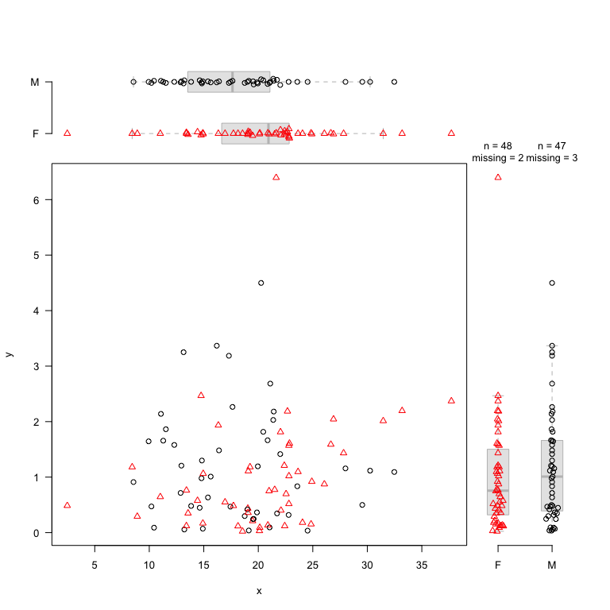
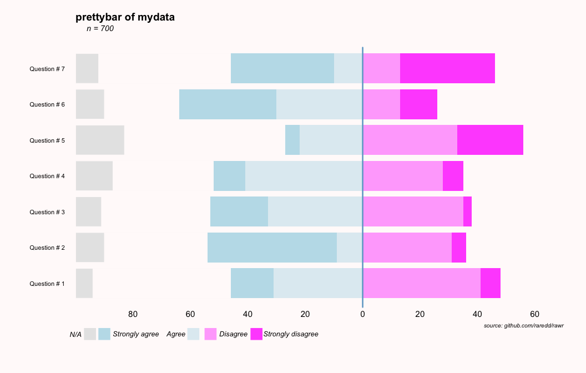
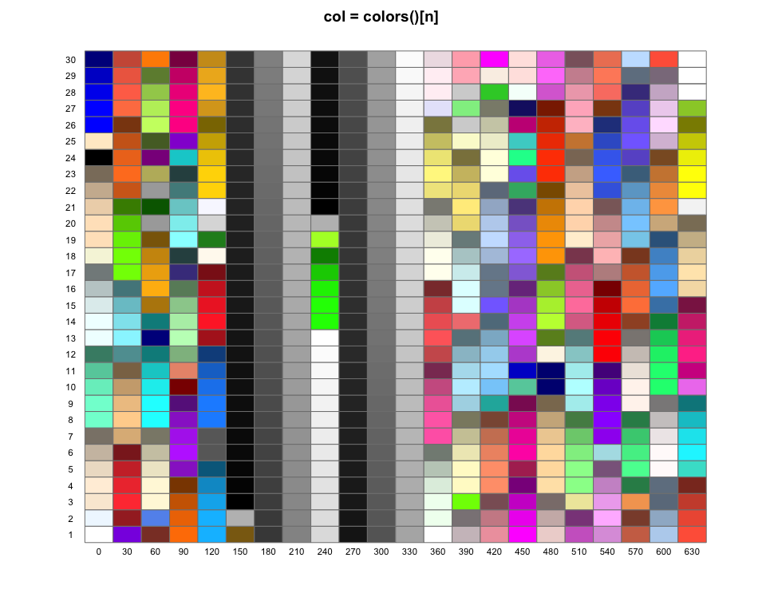
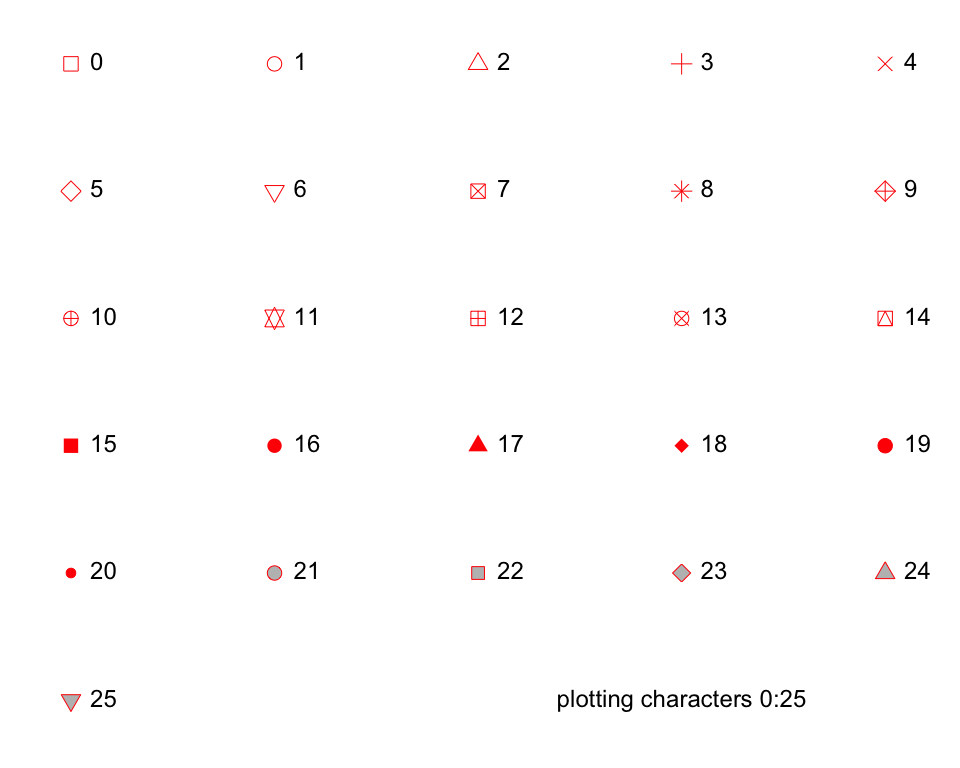
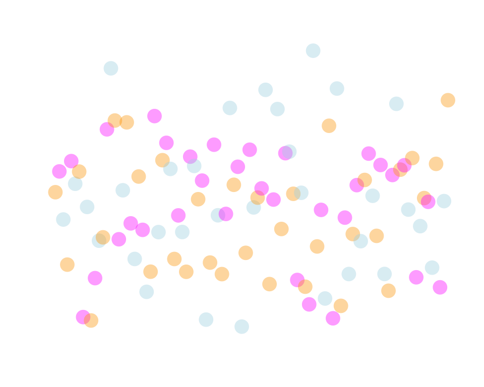
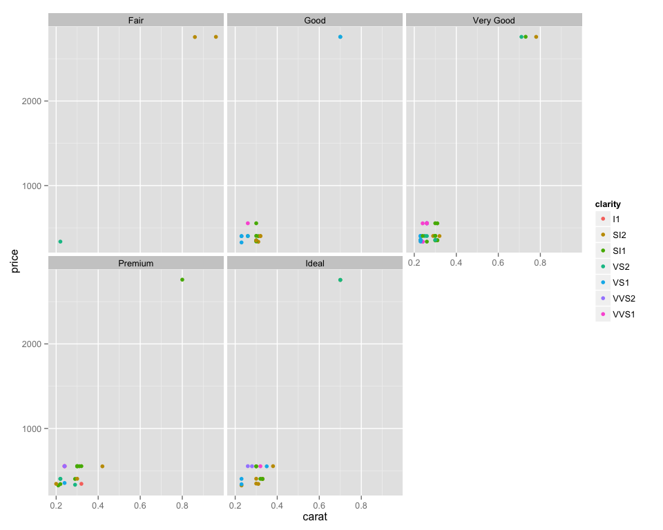
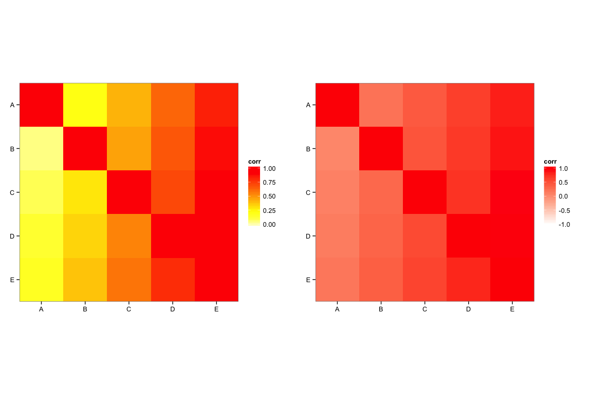
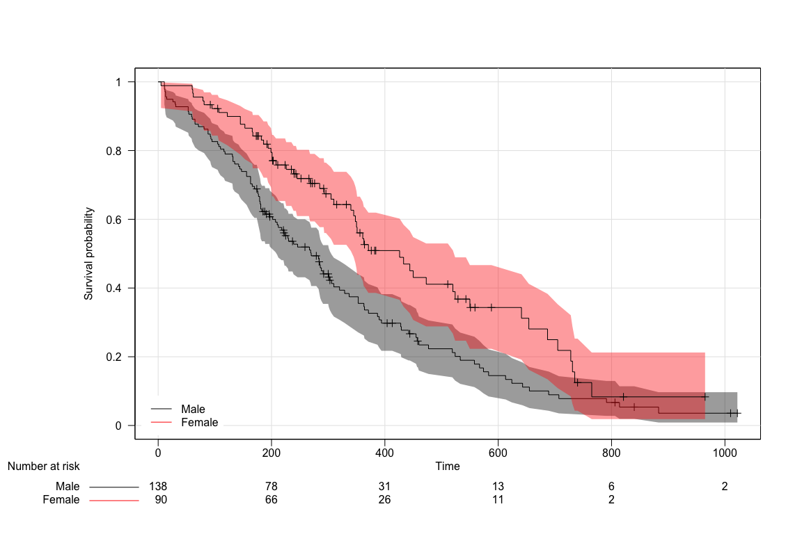
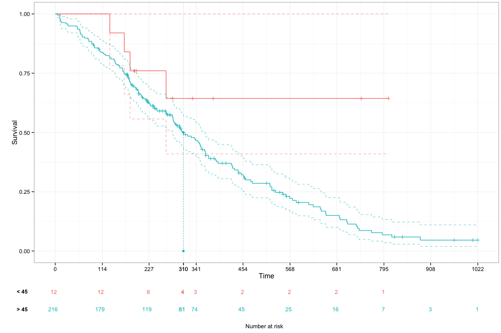

<font align = center>

**[joint marginal, box, discrete scatter plots](#special)** | **[pretty bar plots](#pretty)** <br> **[plotting utilities](#utils)** | **[interactive plots](#inter)** <br> **[other gg plots](#other)** | **[survival plots in base and gg](#surv)**

</font>

more stuff <a href = 'https://github.com/raredd/rgraphics'>here</a>

---


### some rawr graphics


```r
library(rawr)
library(ggplot2)
library(grid)
library(gridExtra)

op <- par(no.readonly = TRUE)
```


### <a id = 'special'>joint marginal, box, and discrete scatter plots</a>


```r
## jmplot
set.seed(1618)
dat <- data.frame(x = rnorm(100, 20, 5),
                  y = rexp(100),
                  z = c('M','F'),
                  zz = c(LETTERS[1:4]))
dat[1:5, 1:2] <- NA
with(dat, jmplot(x, y, z, type = 'db', jit = .02, col = 1:2, las = 1,
     group.col = TRUE, pch = 1:2, group.pch = TRUE, boxcol = grey(.9),
     cex.n = .8))
```

<figure><figcaption>Figure 1: special plots</figcaption></figure>

```r
## tplot
par(op)
set.seed(1618)
dat <- data.frame(age = rnorm(80, rep(c(26, 36), c(70, 10)), 4),
                  sex = sample(c('Female', 'Male'), 80, replace = TRUE),
                  group = paste0('Group ',
                                 sample(1:4, 40, prob = c(2, 5, 4, 1),
                                        replace = TRUE)))
dat[1:5, 'age'] <- NA
tplot(age ~ group, data = dat, las = 1, cex.n = .8, cex.axis = 1, bty = 'L',
      type = c('db', 'db', 'db', 'd'), names = LETTERS[1:4],
      group.pch = TRUE, pch = c(15, 17, 19, 8),
      group.col = FALSE, col = c('darkred', 'darkblue')[c(sex)],
      boxcol = c('lightsteelblue1', 'lightyellow1', grey(.9)),
      boxplot.pars = list(notch = TRUE, boxwex = .5))
```

<figure><figcaption>Figure 2: special plots</figcaption></figure>

```r
## dsplot
par(op)
set.seed(1618)
x <- round(rnorm(400, 100, 4))
y <- round(rnorm(400, 200, 4))
sex <- sample(c('Female', 'Male'), 400, replace = TRUE)
dsplot(y ~ x, pch = 19, col = 1 + (sex %in% 'Female'), cex = .6,
       xlab = 'measurement 1', ylab = 'measurement 2', bty = 'L')
legend('bottomright', pch = 19, col = 1:2, bty = 'n',
       legend = c('Male', 'Female'), cex = .8)
```

<figure><figcaption>Figure 3: special plots</figcaption></figure>


### ### <a id = 'pretty'>pretty bars</a>


```r
## kinda pretty?
prettybars(mtcars$mpg, y = rownames(mtcars), col.bg = 'snow',
           emph = rownames(mtcars)[grepl('Merc', rownames(mtcars))],
           extra.margin = 1, col.emph = 'cyan2',
           FUN = quantile, probs = c(.25, .5, .75), na.rm = TRUE, 
           fun.lab = c('lower quartile','median','upper quartile'),
           note = "if you buy a Merccedes,\nget ready to pay for lots of gas",
           title = 'motor trend cars', sub = '   (miles per gallon)')
```

<figure><figcaption>Figure 4: prettybars</figcaption></figure>

```r
## a face only a mother could love
set.seed(1618)
f <- function(...) sample(1:5, 100, replace = TRUE, prob = c(...))
dat <- data.frame(q1 = f(.1, .2, .3, .3, .1),
                  q2 = f(.1, .4, .1, .3, .1),
                  q3 = f(.1, .2, .3, .3, .1),
                  q4 = f(.1, .1, .3, .3, .1),
                  q5 = f(.2, .1, .2, .3, .2),
                  q6 = f(.1, .3, .3, .2, .1),
                  q7 = f(.1, .4, .1, .1, .3))
dat <- stack(dat)
dat <- within(dat, {
  values <- factor(values, levels = 1:5, labels = c('NA','SA','A','D','SD'))})

mydata <- table(dat)
cols <- c(grey(.9), tcol(c('lightblue','lightblue','magenta1','magenta1'), 
               c(200, 100, 100, 200)))

prettybars2(mydata, lab.y = paste('Question #', 1:7), extra.margin = 3, 
            col.group = cols)
```

<figure><figcaption>Figure 5: prettybars</figcaption></figure>


```r
## a pretty legend
par(mfrow = c(2,1))
with(mtcars,
     plot(mpg, pch = 19, cex = 2, main = 'color by weight (red = heavier)',
     col = colorRampPalette(c('yellow','red'))(1000)[rescaler(wt, c(1, 1000))]))
with(mtcars,
     plot(mpg, pch = 19, cex = 2, bty = 'l', main = 'color by weight (red = heavier)',
     col = color.bar(c('yellow','red'), x = wt, y = mpg, labels = wt)))
```

<figure><figcaption>Figure 6: Legend</figcaption></figure>


### <a id = 'utils'>plotting utilities</a>


```r
## show colors
colors()[70]
```

```
## [1] "cyan2"
```

```r
show.colors()
```

<figure><figcaption>Figure 7: Utilities</figcaption></figure>

```r
## show plotting characters
show.pch()
```

<figure><figcaption>Figure 8: Utilities</figcaption></figure>

```r
## transparent colors
cols <- c('orange', 'magenta1', 'lightblue')
plot(rnorm(100), col = tcol(cols, 100), pch = 16, cex = 4, 
     axes = FALSE, xpd = NA, xlab = '', ylab = '')
```

<figure><figcaption>Figure 9: Utilities</figcaption></figure>

```r
## add missing facets for some ggplots

## ?facet_adjust
library(ggplot2)
library(grid)
# missing some labels
(tmp <- ggplot(diamonds[1:100, ], aes(carat, price, colour = clarity)) +
  geom_point() + facet_wrap( ~ cut))
```

<figure><figcaption>Figure 10: Utilities</figcaption></figure>

```r
facet_adjust(tmp)
```

<figure><figcaption>Figure 11: Utilities</figcaption></figure>

```r
## ?dodge
par(op)
set.seed(1618)
dat <- data.frame(x = rpois(50, 1), grp = 1:5)
par(list(mfrow = c(2, 2),
         mar = c(3,1,2,2)))
with(dat, plot(grp, x, main = 'overlapping points'))
with(dat, plot(grp, x, cex = runif(100), main = 'still overlapping points'))
with(dat, plot(jitter(grp), x, main = 'adding random noise'))
with(dat, plot(grp + dodge(x ~ grp, dat), x, main = 'dodge points'))
```

<figure><figcaption>Figure 12: Utilities</figcaption></figure>


### <a id = 'inter'>interactive base plots</a>


```r
## add shapes or text (and expressions) interactively

?click.shape

?click.text
```


### <a id = 'other'>other gg plots</a>


```r
## heat map

## ?ggheat
tmp <- rescaler(matrix(1:25, 5))
diag(tmp) <- 1
colnames(tmp) <- rownames(tmp) <- LETTERS[1:5]
grobs <- list(ggheat(cors = tmp, limits = c(0, 1)),
              ggheat(cors = tmp, gradn = NULL, gradc = c('white','red')))
(do.call(arrangeGrob, c(grobs, nrow = 1, ncol = 2)))
```

<figure><figcaption>Figure 13: Other ggplots</figcaption></figure>

```r
## caterpillar plot

## ?ggcaterpillar
library(lme4)
fit <- lmer(Reaction ~ Days + (Days | Subject), data = sleepstudy)
ggcaterpillar(ranef(fit, condVar = TRUE))
```

```
## $Subject
```

<figure><figcaption>Figure 14: Other ggplots</figcaption></figure>


### <a id = 'surv'>survival plots in base and gg</a>


```r
## create kaplan-meier or cox ph plots with base or gg
try_require(survival)
cancer <- within(cancer, {
  age.cat <- factor(as.numeric(cut(age, c(-Inf, 50, 60, 70, Inf))))
})
kmfit <- survfit(Surv(time = time, event = status) ~ sex, data = cancer,
  conf.type = 'log-log')
coxfit <- survfit(coxph(Surv(time = time, event = status) ~ strata(I(age > 45)),
  data = cancer))
## base plots
## ?kmplot
kmplot(kmfit, dev = FALSE, col.band = 1:2, strata.lab = c('Male','Female'))
```

<figure><figcaption>Figure 15: Survival curves</figcaption></figure>

```r
## ggplot plots
## ?ggsurv
ggsurv(coxfit, legend.labels = c('< 45','> 45'), legend = FALSE, median = TRUE)
```

```
## ticks not specified: 
## tick marks defaulting to seq(0, max(time), length.out = 10)
```

```
## 
## strata labels recoded as follows:
## 
##            original replaced
## 1 I(age > 45)=FALSE     < 45
## 2  I(age > 45)=TRUE     > 45
## level(s) < 45 > 45 added to factor variable survdat$strata 
## median survival times:
## I(age > 45)=FALSE  I(age > 45)=TRUE 
##                NA               310
```

<figure><figcaption>Figure 16: Survival curves</figcaption></figure>


---

<font align = center>

<a href="mailto:raredd01@gmail.com?subject=rawr">email</a>

Most recent compile: 16 May 2014 (R version 3.1.0 (2014-04-10))

</font>
