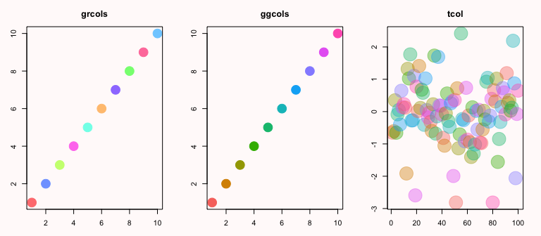

<font align = center>

**[utils](#utils)** | **[stat things](#stats)** | **[dumb things](#dumb)**

</font>

---


```r
library(rawr)
```


### <a id = 'utils'>some rawr utilities</a>


```r
options(width = 100)
## load packages silently

## ? try_require
try_require(Hmisc)  # Hmisc is stupidly noisy


## search functions for data frames and R history

## ?search.hist

## ?search.df
df <- within(mtcars, make <- rownames(mtcars))
search.df(110, df, hp)
```

```
##                 mpg cyl disp  hp drat    wt  qsec vs am gear carb           make
## Mazda RX4      21.0   6  160 110 3.90 2.620 16.46  0  1    4    4      Mazda RX4
## Mazda RX4 Wag  21.0   6  160 110 3.90 2.875 17.02  0  1    4    4  Mazda RX4 Wag
## Hornet 4 Drive 21.4   6  258 110 3.08 3.215 19.44  1  0    3    1 Hornet 4 Drive
```

```r
search.df("Posch", df, make, var = 1)  # inexact matching
```

```
##               mpg cyl  disp hp drat   wt qsec vs am gear carb          make
## Porsche 914-2  26   4 120.3 91 4.43 2.14 16.7  0  1    5    2 Porsche 914-2
```

```r
## data frame, matrix, vector recoder

## ?recoder
ht(recoder(mtcars, c(6, 1, 110), NA), sep = "...")
```

```
##                    mpg  cyl  disp   hp drat    wt  qsec   vs   am gear carb
## Mazda RX4           21 <NA>   160 <NA>  3.9  2.62 16.46    0 <NA>    4    4
## Mazda RX4 Wag       21 <NA>   160 <NA>  3.9 2.875 17.02    0 <NA>    4    4
## Datsun 710        22.8    4   108   93 3.85  2.32 18.61 <NA> <NA>    4 <NA>
## Hornet 4 Drive    21.4 <NA>   258 <NA> 3.08 3.215 19.44 <NA>    0    3 <NA>
## Hornet Sportabout 18.7    8   360  175 3.15  3.44 17.02    0    0    3    2
## Valiant           18.1 <NA>   225  105 2.76  3.46 20.22 <NA>    0    3 <NA>
## 7                  ...  ...   ...  ...  ...   ...   ...  ...  ...  ...  ...
## Porsche 914-2       26    4 120.3   91 4.43  2.14  16.7    0 <NA>    5    2
## Lotus Europa      30.4    4  95.1  113 3.77 1.513  16.9 <NA> <NA>    5    2
## Ford Pantera L    15.8    8   351  264 4.22  3.17  14.5    0 <NA>    5    4
## Ferrari Dino      19.7 <NA>   145  175 3.62  2.77  15.5    0 <NA>    5 <NA>
## Maserati Bora       15    8   301  335 3.54  3.57  14.6    0 <NA>    5    8
## Volvo 142E        21.4    4   121  109 4.11  2.78  18.6 <NA> <NA>    4    2
```

```r
## ruby || analoge

## ?oror
NULL || TRUE
```

```
## Error: invalid 'x' type in 'x || y'
```

```r
NULL %||% TRUE
```

```
## [1] TRUE
```

```r
## inside interval

## ?inside
1:5 %inside% c(3, 7)
```

```
## [1] FALSE FALSE  TRUE  TRUE  TRUE
```

```r
## negation of ?'%in%'

## ?notin
1:5 %ni% c(3, 7)
```

```
## [1]  TRUE  TRUE FALSE  TRUE  TRUE
```

```r
## concatenate a named list

## ?clist
clist(list(a = 1, b = 2))
```

```
## [1] "a = 1, b = 2"
```

```r
## more information from ls()

## ?lss
lst <- list()
mat <- matrix(1:9, 3)
lss()
```

```
##           type size     sizef nrow ncol
## df  data.frame 8960    8.8 Kb   32   12
## lst       list   40  40 bytes    0   NA
## mat     matrix  248 248 bytes    3    3
```

```r
## generalized ?identical for > 2 objects

## ?ident
ident(.GlobalEnv, environment(), globalenv(), as.environment(1))
```

```
## [1] TRUE
```

```r
## apply list of functions

## ?fapply
fapply(mtcars, list(min, mean, max, length))
```

```
##        min   mean   max length
## mpg   10.4  20.09  33.9     32
## cyl      4  6.188     8     32
## disp  71.1  230.7   472     32
## hp      52  146.7   335     32
## drat  2.76  3.597  4.93     32
## wt   1.513  3.217 5.424     32
## qsec  14.5  17.85  22.9     32
## vs       0 0.4375     1     32
## am       0 0.4062     1     32
## gear     3  3.688     5     32
## carb     1  2.812     8     32
```


### <a id = 'stats'>stat things</a>


```r
## binomial confidence interval formatter

## ?binconr
list(binconr(5, 10, 0.9, est = FALSE), binconr(45, 53, 0.95, digits = 1))
```

```
## [[1]]
## [1] "(90% CI: 22.24 - 77.76)"
## 
## [[2]]
## [1] "84.9 (95% CI: 72.4 - 93.3)"
```

```r
## interval formatter

## ?intr
list(intr(mtcars$mpg), intr(mtcars$mpg, conf = 0.95))
```

```
## [[1]]
## [1] "19.20 (min 10.40; max 33.90)"
## 
## [[2]]
## [1] "19.20 (95% CI: 10.40 - 32.74)"
```

```r
## rounding formatter

## ?roundr
roundr(c(-2e-04, 2e-04, 0.5, -0.5, -0.002), digits = 3)
```

```
## [1] "0.000"  "0.000"  "0.500"  "-0.500" "-0.002"
```

```r
## p-value formatter

## ?pvalr
pvals <- c(0.13354, 0.060123, 0.004233, 1.6223e-07)
pvalr(pvals, digits = 3)
```

```
## [1] "0.13"    "0.060"   "0.004"   "< 0.001"
```

```r
## simon two-stage designs

## ?simon2
simon2(p0low = 0.55, p0high = 0.6, p1low = 0.75, ntmax = 45, beta.max = 0.1)
```

```
## $designs
##        p0   p1 n1 r1 n2 r2 Pstop1.H0    size   type2 E.tot.n.H0
## [1,] 0.55 0.75 18 10 23 26    0.6085 0.09327 0.09907      27.00
## [2,] 0.55 0.75 22 13 21 27    0.7236 0.09424 0.09901      27.80
## [3,] 0.55 0.75 21 12 20 26    0.6587 0.09335 0.09564      27.83
## [4,] 0.56 0.75 20 11 22 27    0.5499 0.09930 0.09826      29.90
## [5,] 0.56 0.75 23 13 19 27    0.5993 0.09974 0.09569      30.61
## 
## $call
## simon2(p0low = 0.55, p0high = 0.6, p1low = 0.75, ntmax = 45, 
##     beta.max = 0.1)
## 
## $description
## [1] "n1, n2 = cases 1st stage and additional # in 2nd"                    
## [2] "r1, r2 = max # responses 1st stage and total to declare trt inactive"
```

```r
## binomial confidence intervals

## ?bincon
bincon(0:10, 10)
```

```
##       Responses Trials PointEst    Lower  Upper  Width
##  [1,]         0     10      0.0 0.000000 0.3085 0.3085
##  [2,]         1     10      0.1 0.002529 0.4450 0.4425
##  [3,]         2     10      0.2 0.025211 0.5561 0.5309
##  [4,]         3     10      0.3 0.066740 0.6525 0.5857
##  [5,]         4     10      0.4 0.121552 0.7376 0.6161
##  [6,]         5     10      0.5 0.187086 0.8129 0.6258
##  [7,]         6     10      0.6 0.262378 0.8784 0.6161
##  [8,]         7     10      0.7 0.347547 0.9333 0.5857
##  [9,]         8     10      0.8 0.443905 0.9748 0.5309
## [10,]         9     10      0.9 0.554984 0.9975 0.4425
## [11,]        10     10      1.0 0.691503 1.0000 0.3085
```

```r
## single-stage exact binomial designs

## ?bintest
bintest(p0low = 0.2, p1low = 0.5, n.max = 25)
```

```
## $designs
##    p0  p1  n r2   type1  power diff
## 1 0.2 0.5 19  6 0.06760 0.9165  0.3
## 2 0.2 0.5 20  6 0.08669 0.9423  0.3
## 3 0.2 0.5 21  7 0.04305 0.9054  0.3
## 4 0.2 0.5 22  7 0.05614 0.9331  0.3
## 5 0.2 0.5 23  7 0.07151 0.9534  0.3
## 6 0.2 0.5 24  7 0.08917 0.9680  0.3
## 7 0.2 0.5 24  8 0.03617 0.9242  0.3
## 8 0.2 0.5 25  8 0.04677 0.9461  0.3
## 
## $call
## bintest(p0low = 0.2, p1low = 0.5, n.max = 25)
## 
## $description
## [1] "n = overall sample size"                                     
## [2] "r2 = minimum number of responders required to reject p0"     
## [3] "diff = signal, difference in null and alternative hypotheses"
```

```r
## coefficient of variation power test

## ?power.cv
power.cv(n = NULL, f = 1.25, cv = 0.2, sig.level = 0.05, power = 0.8, distribution = "normal")
```

```
## 
##      Two-sample t test power calculation 
## 
##               n = 12.87
##               f = 1.25
##              cv = 0.2
##       sig.level = 0.05
##           power = 0.8
##     alternative = two.sided
##     distributon = normal
## 
## NOTE: n is number in *each* group
```


### <a id = 'dumb'>dumb stuff</a>


```r
## sparkbar

## ?spark
spark(rpois(10, 3))
```

```
## [1] ▂▃▁▇▃▅▁▂▅▂
```

```r
## color functions
par(mfrow = c(1, 3), pch = 20, bg = "snow", mar = c(3, 3, 3, 2))
plot(1:10, col = grcols(10), main = "grcols", cex = 4)
plot(1:10, col = ggcols(10), main = "ggcols", cex = 4)
plot(rnorm(100), col = tcol(ggcols(10), 100), main = "tcol", cex = 6)
```

<figure><figcaption>Figure 1: Color functions</figcaption></figure>


```r
## a game

## ?witchcraft
witchcraft()

## progress bar for the anxious

## ?progress
for (ii in 1:100) {
    progress(ii/100 * 100)
    Sys.sleep(0.01)
}

## others
rescaler
ht
psum
dlt.table
zoomin
```


---

<font align = center>

<a href="mailto:raredd01@gmail.com?subject=rawr">email</a>

Most recent compile: 16 May 2014 (R version 3.1.0 (2014-04-10))

</font>
